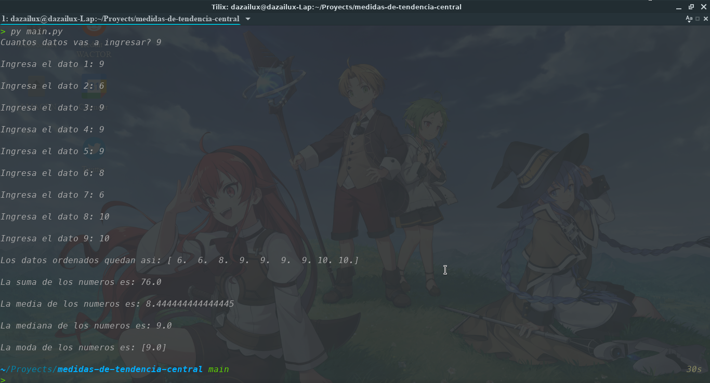

# Measures of central tendency
With this script it allows you to get the median mean and mode of a set of numbers

## Installation

Use the package manager [pip](https://pip.pypa.io/en/stable/) to install numpy.

```bash
pip install numpy
```




## Contributing
Pull requests are welcome. For major changes, please open an issue first to discuss what you would like to change.

Please make sure to update tests as appropriate.

## License
[MIT](https://choosealicense.com/licenses/mit/)
